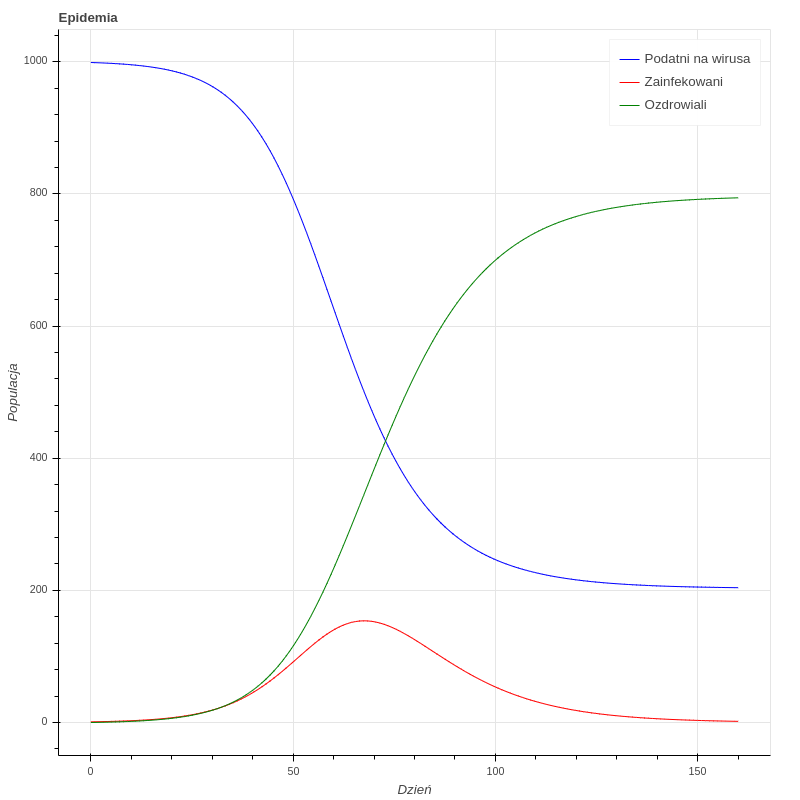

# Model epidemii SIR

Mając trzy równania róźniczkowe


Jesteśmy w stanie przewidzieć jak potoczy się epidemia, tzn stworzyć wykres zmiany populacji od czasu.

### Funkcja róźniczkująca
Zwraca wektory, oznaczające kolejno liczbę osób podatnych na zakażenie, zakażonych i już ozdrowiałych.

```python
def deriv(y, t, N, beta, gamma):
    S, I, R = y
    dSdt = -beta * S * I / N
    dIdt = beta * S * I / N - gamma * I
    dRdt = gamma * I
    return dSdt, dIdt, dRdt

# Initial conditions vector
S0 = Nx - I0x - R0x
y0 = S0, I0x, R0x
# Integrate the SIR equations over the time grid, t.
ret = odeint(deriv, y0, tx, args=(Nx, betax, gammax))
S, I, R = ret.T
```

### Biblioteka Bokeh
Wykorzystano bibliotekę bokeh, która udostępnia interfejs do stworzenia interaktywnej aplikacji.
Biblioteka wystawia naszą aplikację na localhost.
Pod adresem http://localhost5006/main pojawia się nasza aplikacja.

#### Widgets
```python
N = TextInput(title="Populacja")
I0 = TextInput(title="Ilość początkowa przypadków")
R0 = TextInput(title="Ilość ozdrowiałych przypadków")
beta = Slider(title="Prawdopodobieństwo zakażenia", value = DEFAULT_VALUE, start=0, end=1, step=0.05)
gamma = Slider(title="Ilość dni do ozdrowienia", value=1, start=1, end=60, step=1)
t = TextInput(title="Okres epidemii")
```

#### Update
```python
source = ColumnDataSource(data=dict(t=[], S=[], I=[], R=[]))

def update_data(attrname, old, new):
  if (N.value=="" or I0.value=="" or R0.value=="" or beta.value=="" or gamma.value=="" or t.value==""):
    return
  Nx = int(N.value)
  I0x = int(I0.value)
  R0x = int(R0.value)
  betax = float(beta.value)
  gammax = 1.0/float(gamma.value)
  tx = np.linspace(0, int(t.value), int(t.value))
  # Initial conditions vector
  S0 = Nx - I0x - R0x
  y0 = S0, I0x, R0x
  # Integrate the SIR equations over the time grid, t.
  ret = odeint(deriv, y0, tx, args=(Nx, betax, gammax))
  S, I, R = ret.T
  source.data = dict(t=tx, S=S, I=I, R=R)

N.on_change('value', update_data)
I0.on_change('value', update_data)
R0.on_change('value', update_data)
beta.on_change('value_throttled', update_data)
gamma.on_change('value_throttled', update_data)
t.on_change('value', update_data)
```
#### Wykres
```python
plot = figure(plot_height=800, plot_width=800, title="Epidemia",
              tools="crosshair,pan,reset,save,wheel_zoom")

plot.line('t', 'S', source=source, line_color="blue", legend_label="Podatni na wirusa")
plot.line('t', 'I', source=source, line_color="red", legend_label="Zainfekowani")
plot.line('t', 'R', source=source, line_color="green", legend_label="Ozdrowiali")
plot.xaxis.axis_label = "Dzień"
plot.yaxis.axis_label = "Populacja"
```

#### Zawartość w aplikacji
```python
inputs = column(N, I0, R0, beta, gamma, t)

curdoc().add_root(row(inputs, plot, width=1500))
curdoc().title = "Epidemic"
```

Na stronie renderuje curdoc().add_root.

Wraz ze zmianami widgetów dokument pojawia się na nowo z odpowiednimi parametrami oraz wyrysowanym plotem. Mamy ograniczenie, że każde pole musi zostać uzupełnione by rysowanie wykresu się powiodło.

### Przykłady wykresów

#### Zmienna ilość populacji
Kolejne wykresy przedstawiają rozwój pandemii przy parametrach
- populacja : 1000, 10000, 100000
- początkowe przypadki zainfekowane: 1
- początkowe przypadki ozdrowiałe: 0
- prawdopodobieństwo zarażenia: 0.2
- ilość dni do wyzdrowienia: 10
- długość pandemii w dniach: 160




Wniosek:  środek epidemii przesuwa się w czasie wraz ze wzrostem populacji (dzień 70, 95, 120).

#### Zmienne prawdopodobieństwo zarażenia się
Kolejne wykresy przedstawiają rozwój pandemii przy parametrach
- populacja : 10000
- początkowe przypadki zainfekowane: 1
- początkowe przypadki ozdrowiałe: 0
- prawdopodobieństwo zarażenia: 0.2, 0.5, 0.8
- ilość dni do wyzdrowienia: 10
- długość pandemii w dniach: 160


Wniosek: im większe prawdopodobieństwo zarażenia się tym szybciej epidemia się kończy.

#### Zmienna ilość początkowych zainfekowanych przypadków
Kolejne wykresy przedstawiają rozwój pandemii przy parametrach
- populacja : 10000
- początkowe przypadki zainfekowane: 1, 10, 50
- początkowe przypadki ozdrowiałe: 0
- prawdopodobieństwo zarażenia: 0.2
- ilość dni do wyzdrowienia: 10
- długość pandemii w dniach: 160


Wniosek: środek epidemii przesuwa się w czasie wraz ze wzrostem początkowych przypadków zainfekowanych (dzień 95, 75, 60). Epidemia przebiega znacznie szybciej.


### Odpalenie aplikacji
Należy mieć zainstalowaną bibliotekę Bokeh
```bash
pip install Bokeh
```

Następnie należy odpalić aplikację na poziomie katalogu src
```bash
bokeh serve main.py
```

Interaktywna aplikacja jest dostępna pod adresem
```
http://localhost:5056/main
```

### Aplikacja użycie


