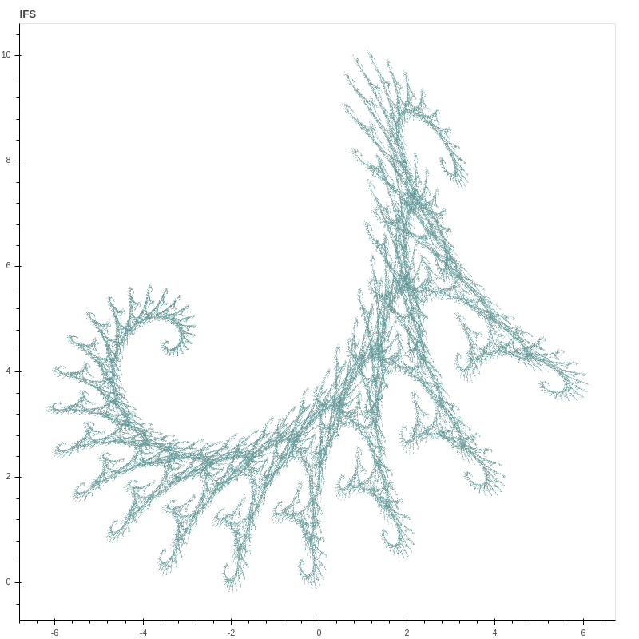
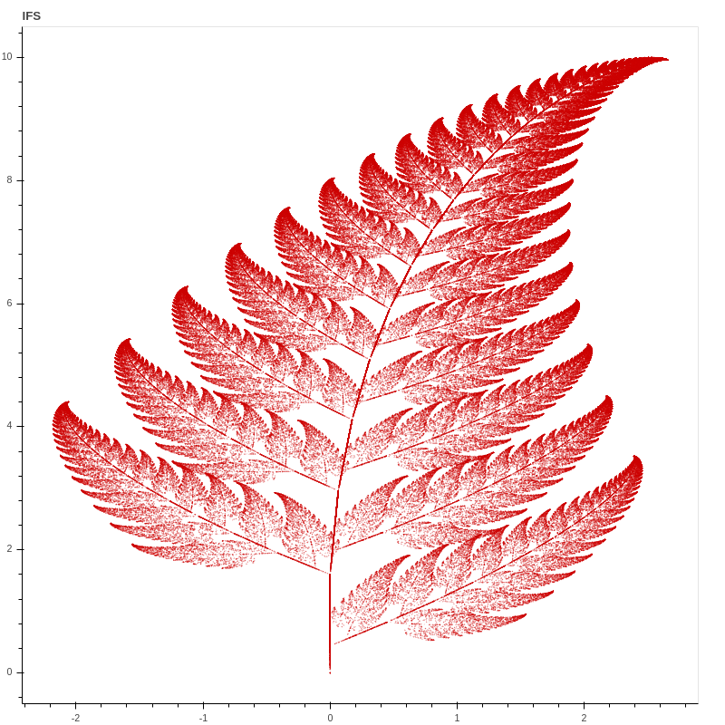
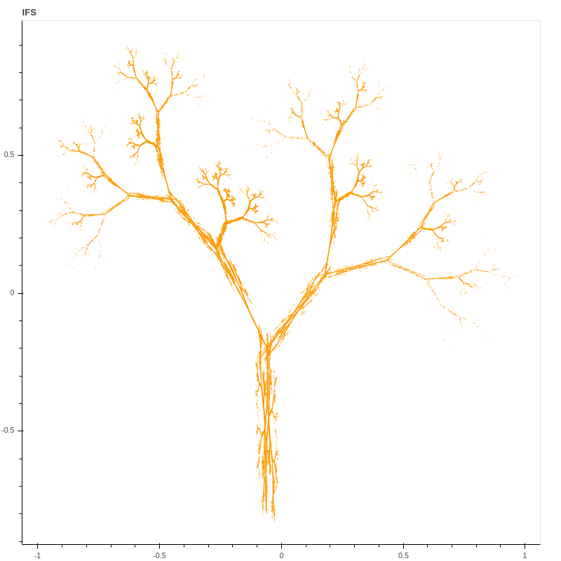
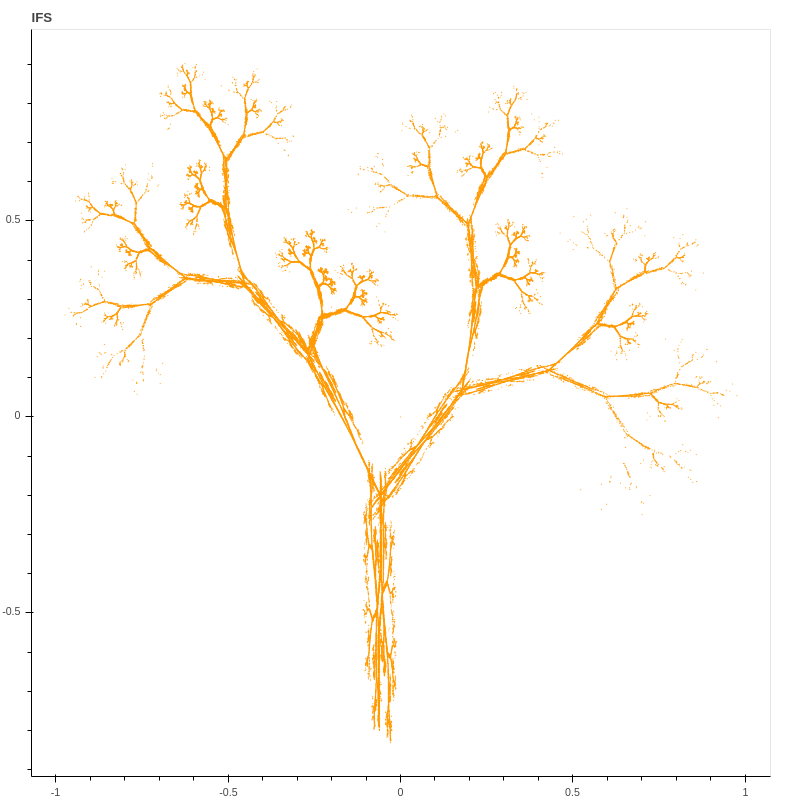
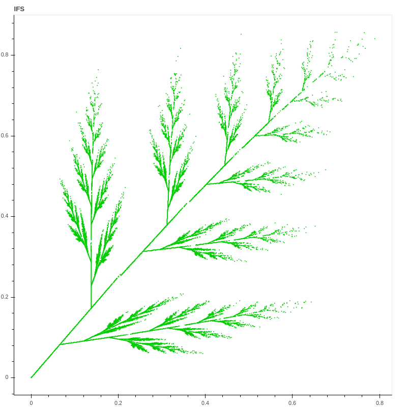
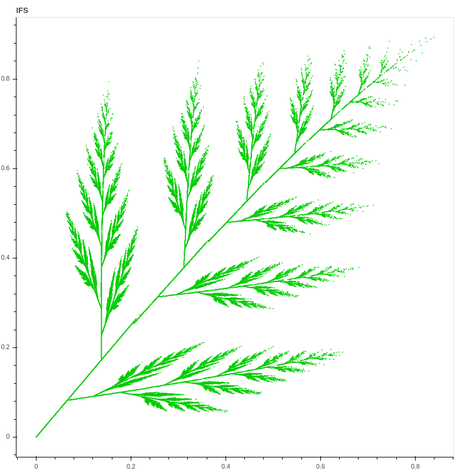
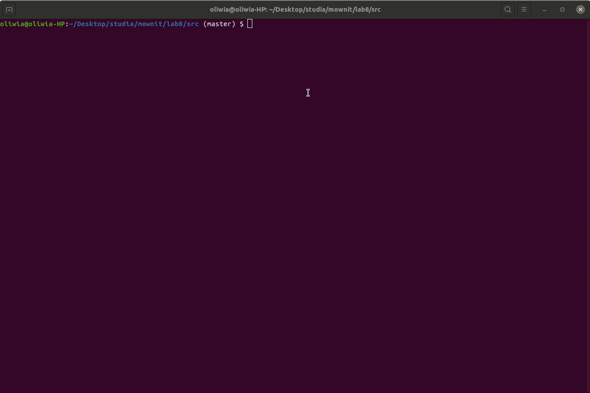

# Fraktale IFS

Posiadając współczynniki a,b,c,d,e,f układu określonej ilości równań możemy wyliczyć kolejne x i y według następujących równań:

x' = ax + by + c

y' = dx + ey + f

Wyliczając kolejne punkty dokonujemy kolejne przekszałcenia. Proces ten jest wykonywany w zależności od ilości iteracji. Im więcej iteracji, tym obraz wyraźniejszy - więcej punktów jest wyrysowywanych. Dla konkretnych równań mamy również prawdopodobieńśtwa ich wylosowania. Suma wszystkich prawdopodobieństw musi się sumować do 1.

### Funkcja zwracająca zbiór punktów IFS
Funkcja w zależności od ilości iteracji oraz zadanego układu równań znajduje zbiór punktów IFS. Ze względu na ilości iteracji oraz niewielkie różnice we współrzędnych punktów możemy pozwolić sobie na przybliżenia punktów, tak by było ich mniej do naniesienia na wykres.
Obraz nie traci na tyle na ostrości byśmy mogli to zauważyć, a przyspiesza to rysowanie wykresu.

```python
def ifs_points(iterations, mat):
  m = len(mat)

  probability = [mat[0][6]]

  for n in range(1, m):
    probability.append(probability[n - 1] + mat[n][6])

  points = [(0, 0)]

  for n in range(iterations):
      r = random.uniform(0, 1)
      for i in range(m):
        if r < probability[i]:
          X, Y = points[-1]
          x = mat[i][0]*X + mat[i][1]*Y + mat[i][4]
          x = round(x, 3)
          y = mat[i][2]*X + mat[i][3]*Y + mat[i][5]
          y = round(y, 3)
          break
      points.append((x,y))

  uniq_points = set(points)
  X, Y = zip(*uniq_points)

  return X, Y
```

### Biblioteka Bokeh
Wykorzystano bibliotekę bokeh, która udostępnia interfejs do stworzenia interaktywnej aplikacji.
Biblioteka wystawia naszą aplikację na localhost.
Pod adresem http://localhost5006/main renderuje się nasza aplikacja.

```python
from bokeh.io import curdoc
from bokeh.layouts import column, row
from bokeh.models import ColumnDataSource, Slider, TextInput, Select
from bokeh.plotting import figure
from ifs import ifs_points, mat_by_type

DEFAULT_ITERS = 10000
DEFAULT_COLOR = "#000000"

x, y = ifs_points(DEFAULT_ITERS, mat_by_type["paproc"])

source = ColumnDataSource(data=dict(x=x, y=y, color=[DEFAULT_COLOR for _ in x]))

# Set up plot
plot = figure(plot_height=800, plot_width=800, title="IFS",
              tools="crosshair,pan,reset,save,wheel_zoom")

plot.scatter('x', 'y', source=source, radius=0.001, fill_color='color', line_color=None)
plot.xgrid.visible = False
plot.ygrid.visible = False


# Set up widgets
obj = Select(title="Obiekt", options=sorted(obj_map.keys()), value="Paproc")
iterations = Slider(title="Ilosc iteracji", value=DEFAULT_ITERS, start=10000, end=1000000, step=DEFAULT_ITERS)
col = Select(title ="Kolor", options=sorted(col_map.keys()), value="Czarny")

def update_data():
    iters = int(iterations.value)
    color = col_map[col.value]
    object_type = obj_map[obj.value]
    mat = mat_by_type[object_type]

    # Generate the new curve
    x, y = ifs_points(iters, mat)

    source.data = dict(x=x, y=y, color=[color for _ in x])

# Set up callbacks

def handle_object_change(attrname, old, new):
    iterations.value = DEFAULT_ITERS
    update_data()

def handle_color_change(attrname, old, new):
    update_data()

def handle_iterations_change(attrname, old, new):
    update_data()

obj.on_change('value', handle_object_change)
col.on_change('value', handle_color_change)
iterations.on_change('value_throttled', handle_iterations_change)


# Set up layouts and add to document
inputs = column(obj, iterations, col)

curdoc().add_root(row(inputs, plot, width=1500))
curdoc().title = "Fractals"
```

Na stronie renderuje curdoc().add_root.

Wraz ze zmianami widgetów dokument renderuje się na nowo z odpowiednimi parametrami oraz wyrysowanym plotem. Każdy widget ma ustawiony handler, który wykonuje się po zmianie wartości odpowiedniego widgetu.

### Przykłady wyrysowanych fraktali





Drzewo w różnych ilości iteracji
Mniejsza ilość iteracji:



Większa ilość iteracji:



Podobnie dla liścia:
Mniejsza ilość iteracji:



Większa ilość iteracji:




##### Wniosek
Im większa ilość iteracji tym więcej puntków zostaje znalezionych, co skutkuje wyraźniejszym obrazem fraktala.

### Odpalenie aplikacji
Należy mieć zainstalowaną bibliotekę Bokeh
```bash
pip install Bokeh
```

Następnie należy odpalić aplikację na poziomie katalogu src
```bash
bokeh serve main.py
```

Interaktywna aplikacja jest dostępna pod adresem
```
http://localhost:5056/main
```

### Aplikacja użycie


